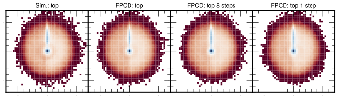

# Fast Point Cloud Diffusion (FPCD)

This is the official implementation of the FPCD paper that uses a diffusion model to generate particle jets while [progressive distillation](https://arxiv.org/abs/2202.00512) is used to accelerate the generation.



# Docker Container
You can fine the docker image to run the scripts in the following [link](https://hub.docker.com/layers/vmikuni/tensorflow/ngc-22.08-tf2-v0/images/sha256-2bfbd4e3af2564a1bd2d0660899a4d295d78eb015f1b1492119774817013670b?context=repo)

Using shifter instead:

```bash
shifterimg -v pull vmikuni/tensorflow:ngc-22.08-tf2-v0
shifter --image=vmikuni/tensorflow:ngc-22.08-tf2-v0 --module=gpu,nccl-2.15
```


# Training a new model

To train a new model from scratch, first download the data with either [30 particles](https://zenodo.org/record/6975118) or [150 particles](https://zenodo.org/record/6975117).
The baseline model can be trained with:
```bash
cd scripts
python train.py [--big]
```
with optiional --big flag to choose between the 30 or 150 particles dataset.
After training the baseline model, you can train the distilled models with:
```bash
python train.py --distill --factor 2
```
This step will train a model that decreases the overall number of time steps by a factor 2. Similarly, you can load the distilled model as the next teacher and run the training using ```--factor 4``` and so on to halve the number of evaluation steps during generation.

To reproduce the plots provided in the paper, you can run:
```bash
python plot_jet.py [--distill --factor 2] --sample
```
The command will generate new observations with optional flags to load the distilled models. Similarly, if you already have the samples generated and stored, you can omit the ```--sample``` flag to skip the generation.

# Plotting and Metrics

The calculation os the physics inspired metrics is taken directly from the [JetNet](https://github.com/jet-net/JetNet) repository, thus also need to be cloned. Notice that while our implementation is carried out using TensorFlow while the physics inspired metrics are implemented in Pytorch.

Out distillation model is partially based on a [Pytorch implementation](https://github.com/Hramchenko/diffusion_distiller).

# Using pre-trained checkpoints

Pretrained checkpoints for 30 and 150 particle datasets are provided for both the initial FPCD model (using 512 steps during generation) and the distilled model for single-shot generation. Those can be directly sampled using the commands

```bash
python plot_jet.py [--distill --factor 512] [--big] --sample
```


